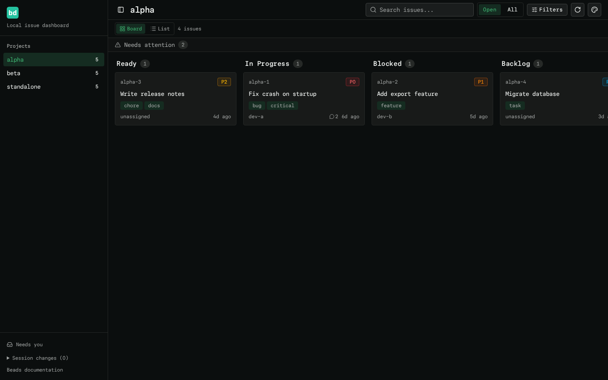

# view-beads

A local web dashboard for [beads](https://github.com/steveyegge/beads) (`bd`)
issue trackers. Run `view-beads` in any folder, get a link, open it in your
browser.

Built with Next.js, shadcn/ui and Tailwind. All data comes from the `bd` CLI.



## Install

```sh
# npm (Node >= 20.9)
npm install -g view-beads

# or run it without installing
npx view-beads
```

Requires `bd` from [beads](https://github.com/steveyegge/beads) on your
`PATH` (or point `BEADS_BIN` at it). The npm package ships the built
standalone server, so it has no runtime npm dependencies.

Alternatively, from this flake (pulls in `bd` automatically):

```sh
nix run github:Prn-Ice/beads-viewer

# or add it to your home-manager packages
inputs.view-beads.packages.x86_64-linux.default
```

## Usage

```sh
cd ~/Projects/my-project
view-beads            # starts the server and opens the browser
view-beads --no-open  # only print the link
```

The server keeps running in the background. Running `view-beads` again reuses
it and just re-opens the browser.

Use **Copy as Markdown** in an issue drawer to copy its loaded details for an
agent handoff or PR discussion. Comments are excluded.

### Which projects are shown?

Every beads project found on your machine, in this order:

1. The project in your current folder (or any parent folder)
2. Workspaces registered in `~/.beads/registry.json`
3. Any folder containing `.beads` under `~/Projects` or `~/Dotfiles`
   (3 levels deep)

Override the search roots with `BEADS_PROJECT_ROOTS=/path/a,/path/b`.

Checkouts that are linked git worktrees (their `.git` is a file, not a
directory — e.g. the `beads-viewer-worker-*` worktrees from
[docs/workers.md](docs/workers.md)) are grouped under a separate **Worktrees**
sidebar section instead of cluttering the main project list. Projects whose
`.beads` exists but no longer works with the installed `bd` (e.g. a stale
pre-dolt database) land under **Broken** with a warning marker.

### GitHub projects

Pick repos from the GitHub settings panel (the gear button in the sidebar's GitHub group),
which lists your `gh` repos and persists the selection to
`~/.config/view-beads/config.json` (override with `VIEW_BEADS_CONFIG`). The
change applies on the next request. Alternatively set
`BEADS_GITHUB_REPOS=owner/repo,owner/repo`; the env var wins when set.

Each repo is mirrored as a shallow, sparse clone (just the `.beads` directory)
under `~/.cache/view-beads/github` (override with `BEADS_GITHUB_CACHE`) and
re-fetched at most once a minute.

Git only syncs the JSONL exports — the beads database is gitignored — so on
first sync a local database is materialized in the clone with `bd init` +
`bd import` (upserted after each re-fetch). The clone is a strictly read-only
mirror: `bd init` runs with `--skip-agents --skip-hooks`, the `sync.remote`
push channel it would otherwise wire back to GitHub is stripped, and nothing
is ever written back. Repos whose `.beads` has no synced issue data are
skipped.

Local projects always load instantly; GitHub repos stream into a separate
sidebar group one at a time as each sync finishes, with a spinner while a
repo syncs and a warning row if it fails.

Requires `git` and an authenticated `gh` CLI (`gh auth login`).

View Beads is an independent dashboard, not an official Beads product.
See [asset sources and licenses](public/brand/README.md) for branding credits.

## Development

```sh
nix develop       # node, git, playwright with browsers
npm run dev       # dev server on http://localhost:3000
npm test          # unit tests (vitest)
npm run test:e2e  # integration tests (playwright)
npm run lint      # eslint
npm run build     # production build (.next/standalone)
```

Environment variables: `BEADS_BIN` (path to `bd`), `BEADS_HOME` (where
`registry.json` lives), `BEADS_PROJECT_ROOTS`, `BEADS_GITHUB_REPOS`,
`BEADS_GITHUB_CACHE`, `GH_BIN` (path to `gh`), `VIEW_BEADS_CONFIG` (config file
path), `VIEW_BEADS_SERVER` (built
`server.js`), `VIEW_BEADS_NO_OPEN`.

## Publishing

`npm publish` builds the standalone server via the `prepack` hook and packs
`bin/` plus `.next/standalone/`. `outputFileTracingExcludes` in
`next.config.ts` keeps local-only data (`.git`, `.beads`, docs, tests) out of
the build, and `scripts/stage-standalone.mjs` stages `public/` and
`.next/static/` into the standalone folder after each build. Installing from
git (rather than the registry) is not supported — the tarball is the only
distribution channel.

## Architecture

- `src/lib/bd.ts` — spawns `bd --json`, the only data access
- `src/lib/discovery.ts` — finds beads projects, flags git worktrees
- `src/lib/config.ts` — local config file (repo selection), atomic writes
- `src/lib/github.ts` — sparse-clone mirror of GitHub beads repos
- `src/lib/cache.ts` — small TTL cache over `bd` output
- `src/app/api/*` — thin JSON endpoints
- `src/components/*` — board, sidebar, issue drawer
- `bin/view-beads.mjs` — CLI wrapper
