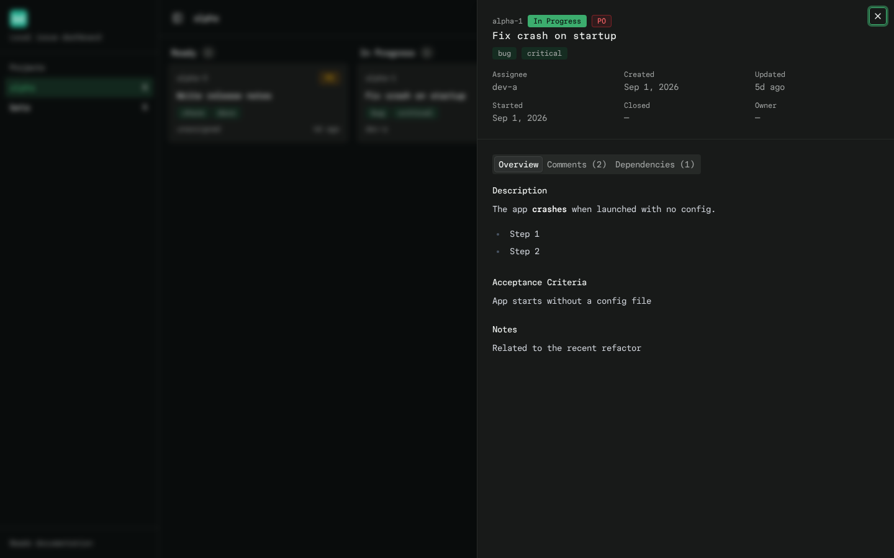
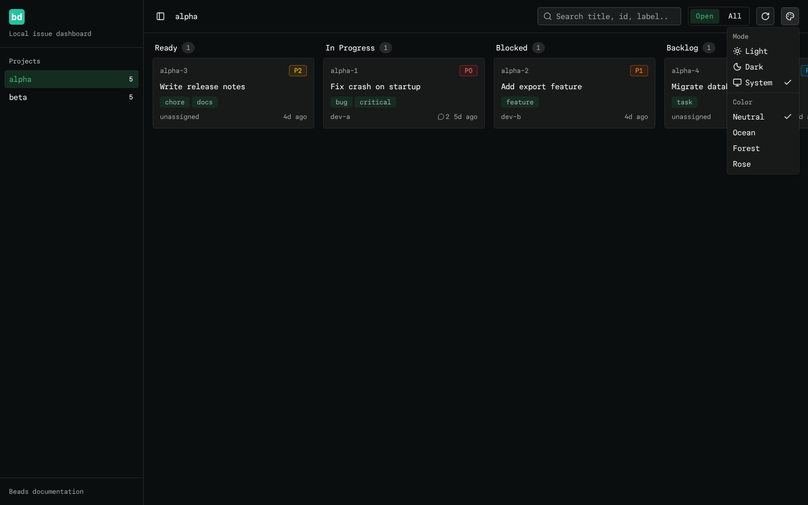
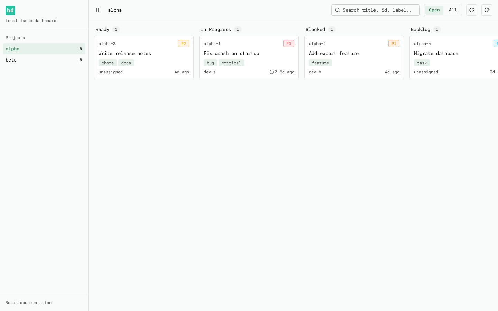
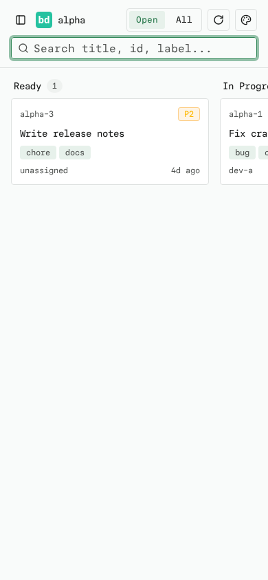
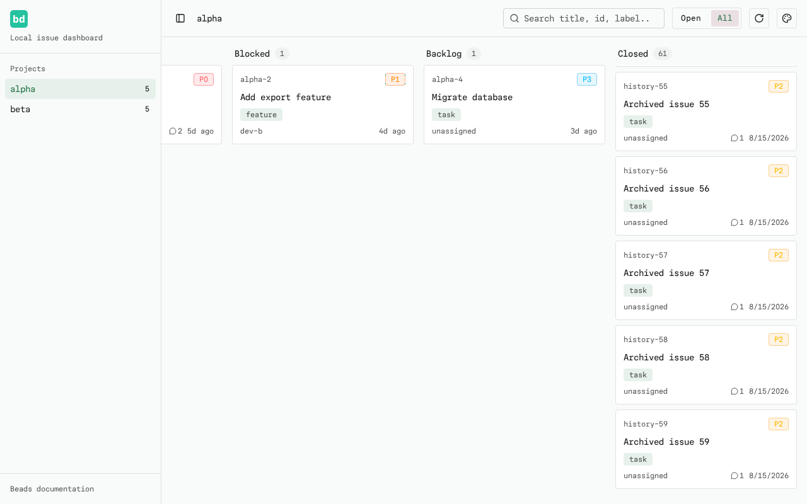

# view-beads

A local web dashboard for [beads](https://github.com/steveyegge/beads) (`bd`)
issue trackers. Run `view-beads` in any folder, get a link, open it in your
browser. All of your beads projects are there — no configuration.

Built with Next.js, shadcn/ui and Tailwind. All data comes from the `bd` CLI,
so nothing here ever writes to your databases.


## Install

```sh
# from this flake
nix run github:Prn-Ice/beads-viewer

# or add it to your home-manager packages
inputs.view-beads.packages.x86_64-linux.default
```

Requires `bd` (the `beads` package) — the nix package pulls it in
automatically.

## Usage

```sh
cd ~/Projects/my-project
view-beads            # starts the server and opens the browser
view-beads --no-open  # only print the link
```

The server keeps running in the background. Running `view-beads` again reuses
it and just re-opens the browser.

### Which projects are shown?

Every beads project found on your machine, in this order:

1. The project in your current folder (or any parent folder)
2. Workspaces registered in `~/.beads/registry.json`
3. Any folder containing `.beads` under `~/Projects` or `~/Dotfiles`
   (3 levels deep)

Override the search roots with `BEADS_PROJECT_ROOTS=/path/a,/path/b`.

## Features

- Board with Ready / In Progress / Blocked / Backlog (and Closed) columns
- Issue drawer with description, acceptance criteria, notes, comments,
  and clickable dependency links
- Search, open/all toggle, 10-second auto-refresh
- Light / dark / system mode and color themes
- Keyboard navigable and screen-reader friendly





Use **Change theme** to choose Neutral, Ocean, Forest, or Rose independently
of light/dark/system mode. Colors tint selected projects, the active scope,
and hover highlights. Both choices are remembered after a reload.

The default Neutral palette follows the [official Beads site](https://beads.gascity.com/):
Paper Mono typography, green accents, soft neutral surfaces, and the official
`bd` mark. Fonts and images are bundled locally, with no external asset requests.
View Beads is an independent dashboard, not an official Beads product.
See [asset sources and licenses](public/brand/README.md).

Apple touch and app icons use the same official artwork. A web app manifest
names the app **View Beads** and requests standalone display where supported.
Installation availability depends on the browser; no service worker or offline
support is included, and the local server must remain running.



**All** adds the Closed column without moving ready issues into Backlog.
Scroll the board horizontally to reach columns outside the viewport; long
columns scroll vertically while the toolbar and column headings stay visible.
On narrow screens, search moves below the toolbar. The sidebar remains
available through **Toggle Sidebar**.





[Mobile All scope](docs/screenshots/beads-all-390.png)

## Development

```sh
nix develop       # node, git, playwright with browsers
npm run dev       # dev server on http://localhost:3000
npm test          # unit tests (vitest)
npm run test:e2e  # integration tests (playwright)
npm run lint      # eslint
npm run build     # production build (.next/standalone)
```

Refresh the branded screenshots with fixture data using
`UPDATE_SCREENSHOTS=1 npm run test:e2e -- tests/e2e/branding.spec.ts`.
Refresh the All-scope scrolling screenshots with
`UPDATE_SCREENSHOTS=1 npm run test:e2e -- tests/e2e/scope.spec.ts`.

Environment variables: `BEADS_BIN` (path to `bd`), `BEADS_HOME` (where
`registry.json` lives), `BEADS_PROJECT_ROOTS`, `VIEW_BEADS_SERVER` (built
`server.js`), `VIEW_BEADS_NO_OPEN`.

## Architecture

- `src/lib/bd.ts` — spawns `bd --json`, the only data access
- `src/lib/discovery.ts` — finds beads projects
- `src/lib/cache.ts` — small TTL cache over `bd` output
- `src/app/api/*` — thin JSON endpoints
- `src/components/*` — board, sidebar, issue drawer
- `bin/view-beads.mjs` — CLI wrapper
