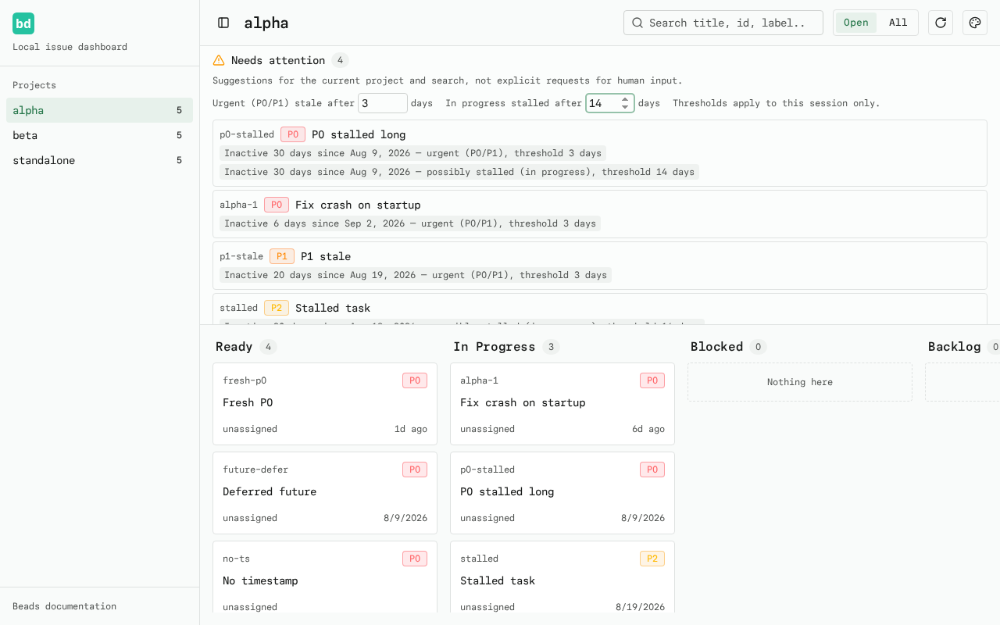
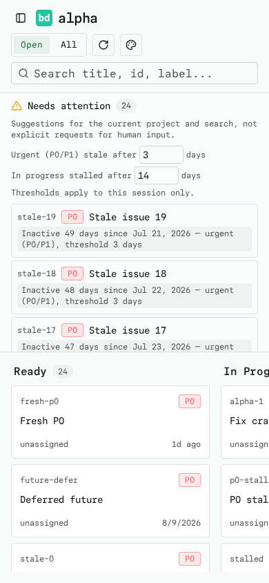

# Needs Attention

A compact, collapsible panel above the board suggests urgent or possibly stalled
work to review, not explicit requests for human input. It uses the current board issues
(so the search box narrows it too) and clicking a row opens that issue's normal
drawer.

## Rules

Two independent, explainable rules each produce a reason shown on the row. An
issue appears once, with one badge per matching reason.

- **Urgent (P0/P1) stale** — priority `0` or `1`, inactive for at least
  `urgent` days (default **3**).
- **Possibly stalled (in progress)** — status `in_progress`, inactive for at
  least `stall` days (default **14**). It is deliberately *possibly stalled*,
  not *abandoned*; no notification or human labeling is implied.

Inactivity is measured from `updated_at`, falling back to `created_at` only
when `updated_at` is absent. Issues with missing or unparseable timestamps are
never claimed stale.

### Exclusions

- `closed` and `deferred` statuses never need attention.
- An issue whose `defer_until` is a valid **future** date is excluded (already
  scheduled). A past or missing `defer_until` does not exclude it.
- Fresh issues below their thresholds are not listed.

### Ordering

Rows sort deterministically: priority ascending, then oldest inactivity first,
then issue id.

## Thresholds

Expand the panel to adjust two positive whole-day inputs (session-only; they
reset on reload). Every reason badge shows the timestamp used, the rule, and
the threshold it crossed, so the list stays explainable.

## Bounded height

The expanded panel scrolls internally (`max-height: 40vh`) so the board columns
stay visible and scrollable on desktop and mobile.

## Screenshots

## Files

- `src/lib/attention.ts` — pure rule logic + unit tests (`attention.test.ts`)
- `src/components/needs-attention.tsx` — collapsible panel component
- `src/components/board.tsx` — renders the panel above the columns
- `tests/e2e/attention.spec.ts` — Playwright coverage
