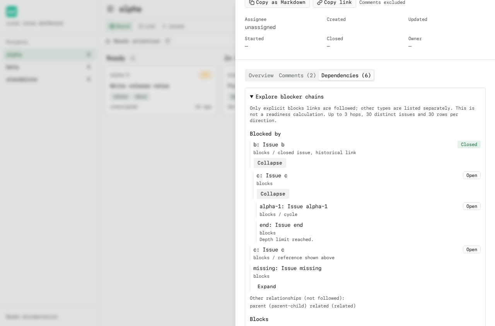
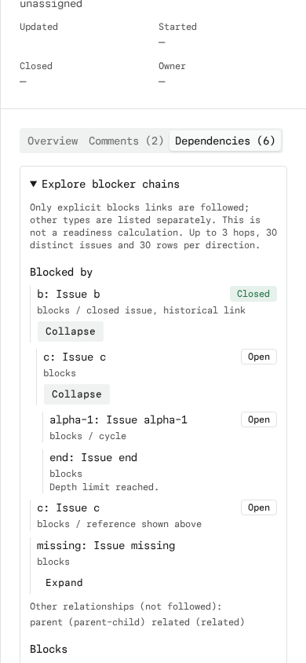

# Blocker Chains

Open an issue's Dependencies tab, then expand **Explore blocker chains**.
**Blocked by** follows prerequisites; **Blocks** follows downstream dependents.
Expand a row to follow another hop, or select its issue to open the drawer and
use the drawer's Back trail to return.

Only explicit `blocks` relationships are traversed. Parent-child, related,
conditional and unknown types remain labelled separately, not interpreted as
ordinary blockers. This is a relationship snapshot, not a replacement for
`bd ready` or its scheduling/gate rules. Closed issues retain historical links.

The explorer fetches full relationships only when opened or expanded. It has
no polling, shares loaded issues across branches, and stops at three hops,
30 distinct issue loads (including the root), and 30 displayed rows per
direction. Further exploration is possible by opening a node as a new root.
Cycles and repeated references stop expansion. Missing data, request failures,
and limits are reported rather than treated as resolved prerequisites. Retry
is explicit and may re-request a failed issue. Data is retained until the
explorer unmounts or the issue changes.

The issue API's optional `relationships=all` query requests
`bd show <id> --include-dependents`; normal drawer loads remain lightweight.
Normalization supports hydrated `id`/`dependency_type` records and raw
`issue_id`/`depends_on_id`/`type` edges, whose `id` may identify an edge instead.

