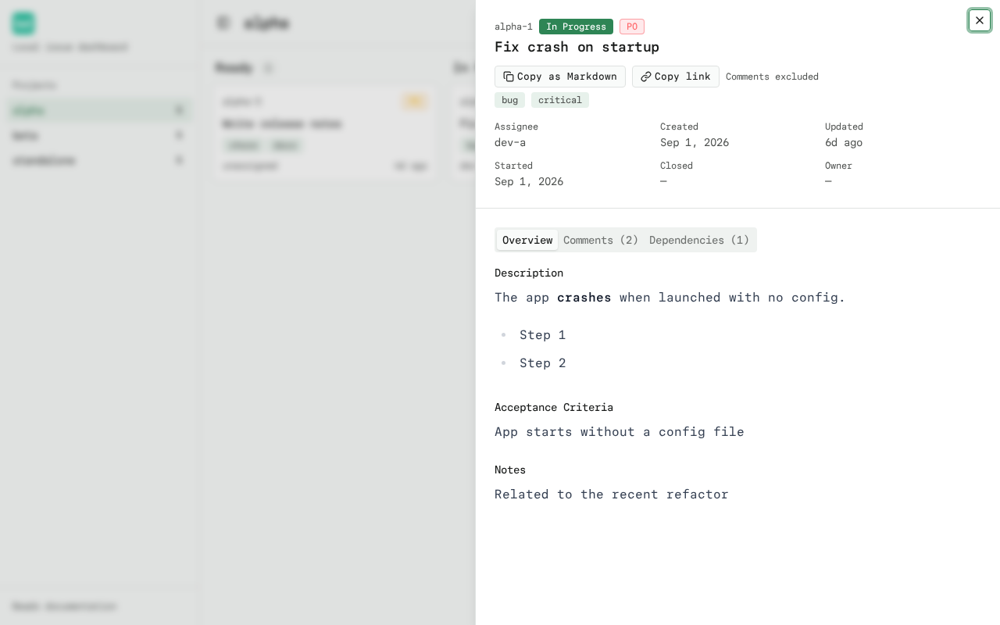
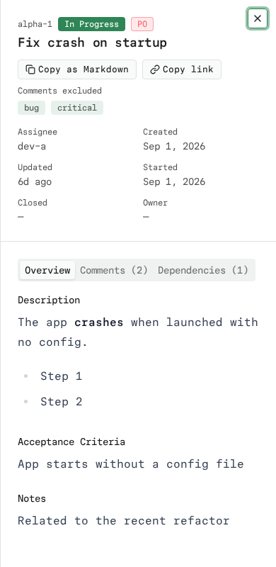

# Deep Links

The dashboard keeps the selected project and any open issue in the URL, so a
board or issue can be bookmarked and shared as a plain link to the local server.

## URL contract

- `project` — the raw absolute path of the beads project. It is URL-encoded by
  `URLSearchParams`, so paths with spaces or special characters just work.
- `issue` — the raw issue id (for example `alpha-1`).

Unrelated query parameters and the URL hash are preserved during navigation and copying.
The issue drawer exposes a **Copy link** button that copies an absolute link to
the currently open issue, keeping any other query parameters and the hash.

Examples:

```
http://localhost:3000/?project=%2Fhome%2Fme%2Fproject&issue=alpha-1
http://localhost:3000/?theme=forest&project=%2Fhome%2Fme%2Fproject&issue=alpha-1#notes
```

## Behavior

- **Reload** restores the project and reopens the issue drawer.
- **Back/Forward** synchronize the board and drawer with the URL.
- **Opening an issue** pushes a history entry; **closing** it removes the `issue`
  parameter and pushes again.
- **Switching projects** clears the open issue.
- The default project selection is not written to the URL, so it never floods
  browser history with redundant entries.
- An **invalid project** shows a notice and the default project without opening
  the issue in a different project. Selecting a project replaces the invalid URL parameter.
- A **missing issue** opens the drawer with an explicit error and a retry action.



