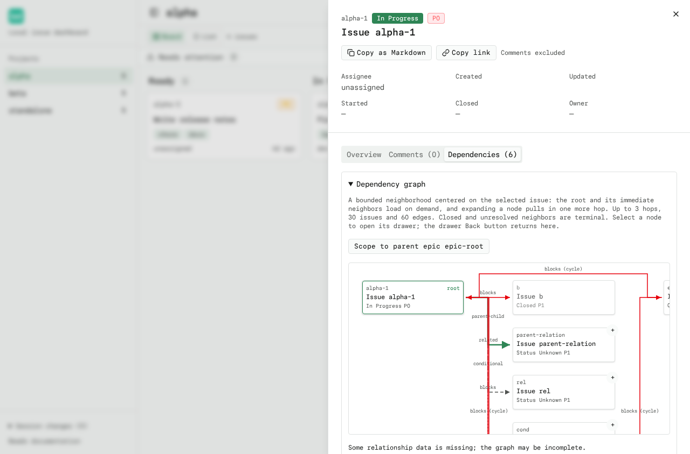
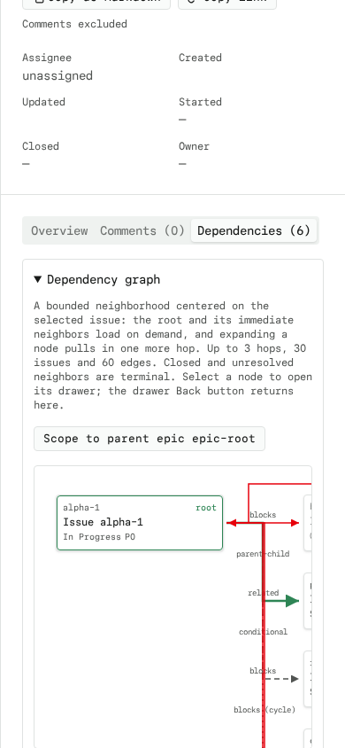

# Dependency Graph

Open an issue's **Dependencies** tab and expand **Dependency graph** to see a
visual node-and-edge neighborhood centered on that issue, complementing the
textual **Explore blocker chains** list beside it.

## What the graph shows

- The selected issue is the **root** node (outlined in the theme accent). Its immediate
  neighbors load on demand when the graph is opened; the drawer's own
  lightweight issue record seeds the first frame.
- **Depends on** edges point from the issue to what it depends on (blockers);
  **Required by** edges point from dependents back to the issue. Edge arrows
  make the direction explicit.
- Node boxes show issue id, title, status, and priority. Selecting any node
  opens it in the **existing drawer**, so the drawer **Back** button walks back
  to the graph's root.

## Typed edges

Edges are styled and labelled by relationship type, with a legend under the
canvas:

| Edge | Style | Meaning |
| --- | --- | --- |
| blocks | solid red arrow | dependent to prerequisite |
| parent-child | solid green arrow | child to parent, in both neighborhood and epic scope |
| related | dashed gray | association, not an ordinary blocker |
| other/unknown | dotted gray | conditional or unknown types |

Directed cycles are marked on the edges (e.g. `blocks (cycle)`). Each issue is
visited once; reverse listings of the same edge are deduplicated, not mistaken
for cycles. Unresolved references appear as dashed "Unresolved reference" nodes
and are disabled — no request is ever made for them. Closed issues stay visible
as muted terminal neighbors. Open a closed issue as the root to explore its
historical relationships. Unknown status or priority is shown explicitly.

## Bounds and on-demand loading

The graph is a **bounded neighborhood**, not a whole-project canvas:

- Up to **3 hops** from the root, **30 distinct issue loads** (including the
  root), and **60 edges**.
- Expanding a node (`+` button, or `Expand` in the list view) fetches exactly
  that issue with `?relationships=all` and adds one more hop. Collapsing it
  hides nodes only reachable through it, without collapsing unrelated branches.
  Cached records and expansion choices are retained until the graph unmounts.
- Loads are cached in memory and happen only on demand — board polling never
  triggers per-issue requests, and an open drawer does not poll.
- The **node/edge limits, missing data, cycles, and failed loads are reported
  explicitly** with a Retry action where useful.

## Epic scope

When the root has a `parent`, the graph offers **Scope to parent epic**; a root
that is itself an epic offers **Scope to this epic**. Scoping replaces the
neighborhood with the epic and direct-child hierarchy (every status), within
the node limit. The full child count is shown, including closed children.
Expand a child to load its connections to other members of this epic; outside
neighbors are deliberately omitted. Unexpanded children's connections are not
known yet. **Back to neighborhood** returns to the regular graph and cancels
pending scope requests. Non-epic parents produce an explicit error.

## Accessibility

- Every node is a native `<button>`: tab to it, press Enter to open the drawer.
- An **equivalent linked list** (same nodes and edges) sits in the **List
  view** disclosure with the same expand/open controls, for screen readers and
  dense text browsing.
- The canvas scrolls inside a bounded region — on mobile the drawer itself
  never overflows horizontally or vertically.

## Files

- `src/lib/dependency-graph.ts` — pure graph build/layout/limits + unit tests
- `src/components/dependency-graph.tsx` — SVG canvas, legend, list view, epic scope
- `src/components/issue-drawer.tsx` — mounts the graph in the Dependencies tab
- `tests/e2e/dependency-graph.spec.ts` — Playwright coverage

