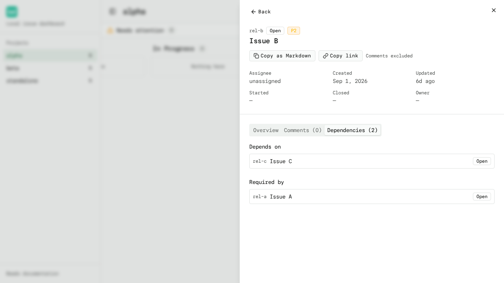
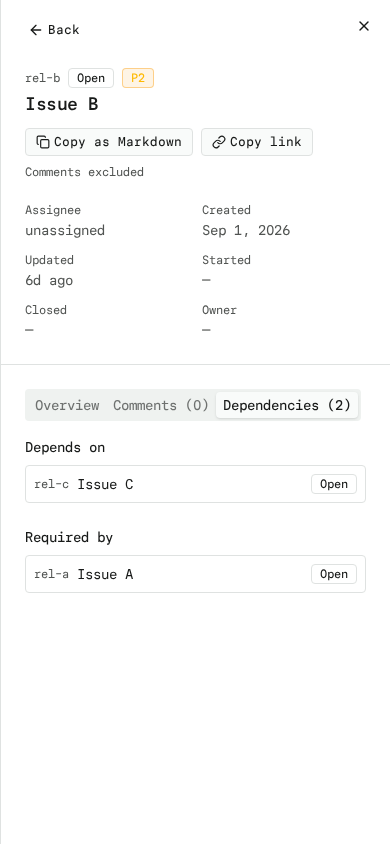

# Drawer Back Trail

While following relationships from the issue drawer (dependencies, parents,
children), the drawer offers a **Back** button that steps back through the
issues you visited. This keeps exploration inside the drawer instead of
spamming browser history with every hop.

## How it works

- Opening an issue from the **board or the attention list** starts a fresh
  trail (no Back button yet).
- Clicking a **relationship link** (Depends on / Required by) extends the
  trail; the drawer shows a Back button.
- **Back** steps to the preceding issue, updating the `project` and `issue`
  URL parameters while preserving unrelated query parameters and the hash.
- At the trail root the Back button disappears.

## What resets the trail

- Closing the drawer (Escape or the close button) and reopening an issue.
- Switching projects — the trail is per project and never bleeds across.
- Loading a deep link directly — a direct URL starts without a trail, though
  relationship navigation from there still builds one.
- Browser Back/Forward starts a fresh drawer session without reviving an old trail.
- New drawer sessions start on Overview; relationship hops preserve the active tab.
- Self-links (an issue listing itself) are a no-op and never grow the trail.

## Browser history

Relationship steps and Back use URL replacement, so the browser history keeps
only project/card-level entries. Browser **Back** returns to the prior page or
board entry and **Forward** reopens the last issue without its old trail.
Trail steps are not separate browser-history entries.

## Keyboard and focus

- The Back button is a plain button and works with Tab + Enter.
- Closing the drawer returns focus to the original board/list trigger when
  possible; after relationship navigation the removed link is never refocused.

