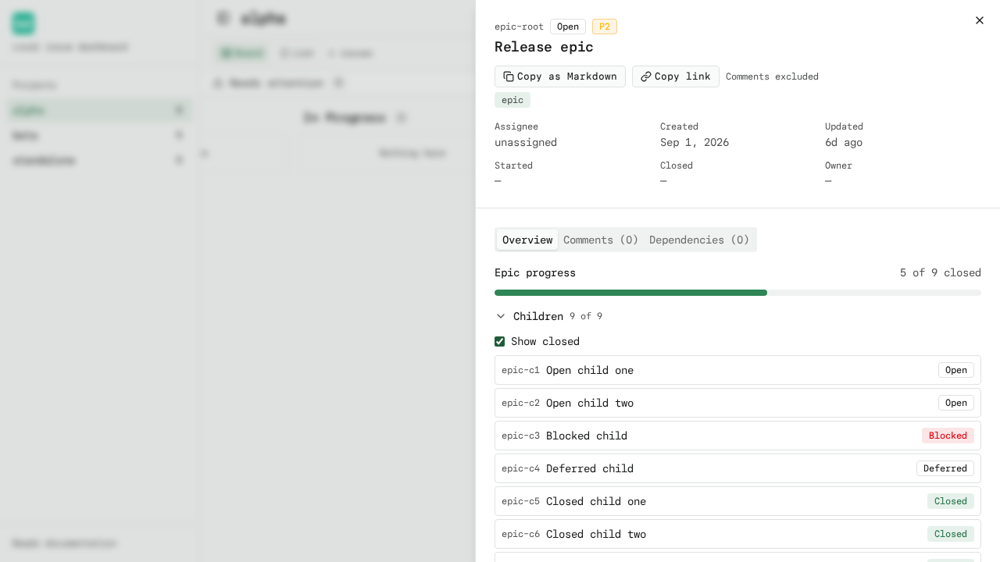
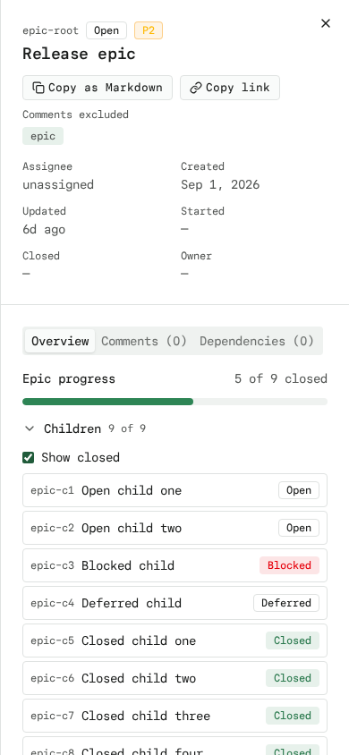

# Epic Progress

When the issue drawer opens an **epic**, the Overview tab shows how much of the
epic is done: a closed/total count, a progress bar, and an expandable list of
the epic's direct children.

## Count semantics

- Progress counts **direct children only** — one level, from `bd list --parent
  <id> --status all --limit 0`. Grandchildren and nested epics are never rolled
  up.
- The count includes **every status** (open, in_progress, blocked, deferred,
  closed), so the denominator is the full child set.
- The board's **Open/All scope, search box, and the drawer's "Show closed"
  toggle never change the denominator.** "Show closed" only filters which
  children are listed.
- Only **parent-child** edges count. Blocking or ordinary dependency links are
  not children and never affect the numbers.
- The numbers are child counts, not effort or velocity.

## Behavior

- Children load **on demand when the epic opens** (a single cached request);
  the drawer never polls them.
- The list is a native `
` expander: keyboard users can expand it with
  Enter or Space on the summary.
- "Show closed" is a simple checkbox inside the expanded list.
- Clicking a child opens it in the **existing drawer** through the same
  relationship callback as dependencies, so the drawer **Back** button walks
  back to the epic.
- A child that is itself an epic opens in its own drawer and shows its own
  progress (one level at a time, no auto-expansion or recursion).
- An epic with no children shows **"No children yet."** and a missing parent
  record never breaks the drawer.
- A failed children request shows an explicit error with a **Retry** button.

## Data flow

`GET /api/projects/<id>/issues/<issueId>/children` runs
`bd list --parent <issueId> --status all --limit 0` and returns a light
child shape (`id`, `title`, `status`, `issue_type`). The endpoint validates the
project like the other issue routes and caches results for 5 seconds.

## Screenshots

## Files

- `src/app/api/projects/[id]/issues/[issueId]/children/route.ts` — children endpoint
- `src/lib/epic-progress.ts` — pure count/filter logic + unit tests
- `src/components/epic-progress.tsx` — drawer Overview progress section
- `src/components/issue-drawer.tsx` — mounts the section for epics
- `tests/e2e/epic-progress.spec.ts` — Playwright coverage