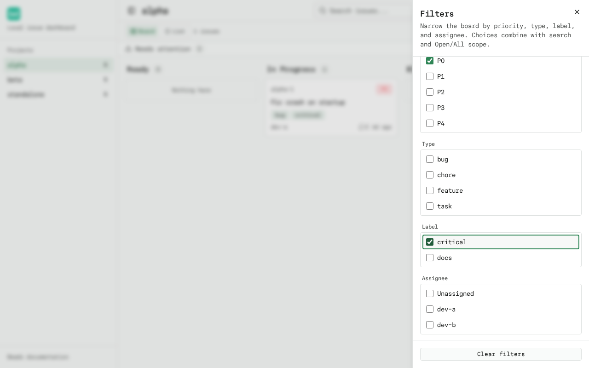
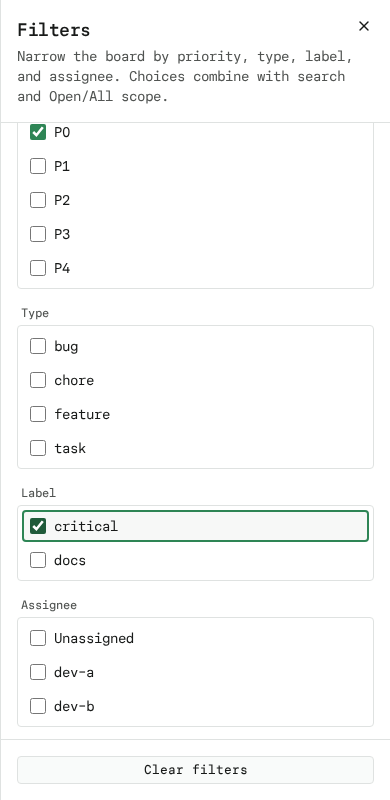

# Filters

The board can be narrowed by **priority**, **issue type**, **label**, and
**assignee** (including **Unassigned**) in addition to the existing search box
and the Open/All scope toggle. Everything lives in the URL, so a bookmark or
shared link is a saved view and the browser Back/Forward buttons restore the
exact board.

One compact **Filters** button sits in the header next to Refresh/theme. It
shows the number of active filter selections and opens an accessible dialog
with a checkbox per option. Selections apply immediately; the dialog stays open
so multiple options can be picked before closing it.

## Matching rules

- **OR within a facet** — selecting priorities P1 and P3 shows issues that are
  P1 *or* P3; the same holds for types, labels, and assignees.
- **AND across facets** — selecting type `bug` and priority P0 shows issues
  that are bugs *and* P0.
- **Unassigned** matches issues with no assignee and combines with selected
  assignee names (dev-a *or* unassigned).
- Filters compose with **search** (all criteria must match) and with the
  **Open/All scope** toggle; switching between Board and List views keeps the
  same filtered issues.
- Filtering is client-side over the already-loaded board data — no extra API
  requests and no per-card detail calls.

## Facet choices

The option lists for type, label, and assignee come from the **unfiltered**
issues of the current scope, so selecting All reveals the closed issues'
choices too, and a label or assignee never disappears from its facet just
because the current result set excludes it. A selected value that no current
issue carries (for example a label typed into a shared URL) stays checked and
listed.

## URL contract

All view parameters are optional; defaults are omitted so plain links keep
working:

| Param | Meaning |
| --- | --- |
| `q` | Search text. Omitted when empty. |
| `scope` | `all` for the All scope. Omitted for the default Open scope. |
| `priority` | Repeated; each value a number from `0` to `4`. Invalid values are ignored. |
| `type` | Repeated; arbitrary issue type names. |
| `label` | Repeated; arbitrary label names. |
| `assignee` | Repeated; arbitrary assignee names. |
| `unassigned` | `1` to include unassigned issues. Kept as a separate boolean so it can never collide with a real assignee named `unassigned`; any other value is ignored. |

Examples:

```
http://localhost:3000/?priority=0&priority=1&label=critical
http://localhost:3000/?project=%2Fhome%2Fme%2Fproject&q=crash&scope=all&assignee=dev-a&unassigned=1&issue=alpha-1#notes
```

Values are percent-encoded by `URLSearchParams`, so labels and assignees with
spaces or special characters round-trip through reload and sharing. Unrelated
parameters (for example `theme` or `filter`) and the URL hash are preserved by
every navigation, including opening/closing an issue drawer.

## History behavior

- **Search typing** pushes one history entry per edit session and then replaces
  it while the input keeps focus, so keystrokes never flood history and a
  later card open can never be overwritten by stale search state. One Back
  undoes the whole edit.
- **Filter selections and scope changes** each push a history entry; Back and
  Forward restore the previous view, and reload restores the URL as-is.
- Invalid `priority` and `scope` values are ignored instead of erroring.

## Files

- `src/lib/filters.ts` — pure parse/serialize/match/facet logic + unit tests (`filters.test.ts`)
- `src/components/issue-filters.tsx` — the Filters button and checkbox dialog
- `src/components/dashboard.tsx` — owns the URL-backed view state
- `tests/e2e/filters.spec.ts` — Playwright coverage

## Screenshots




