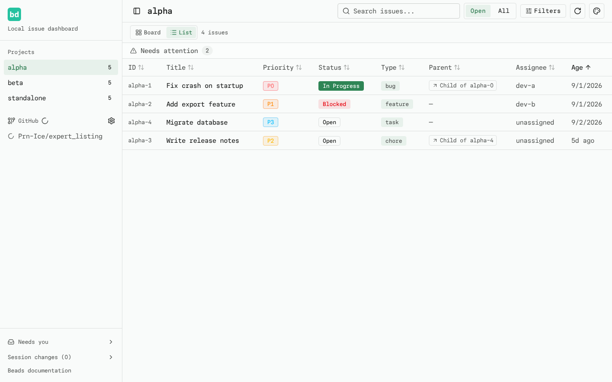
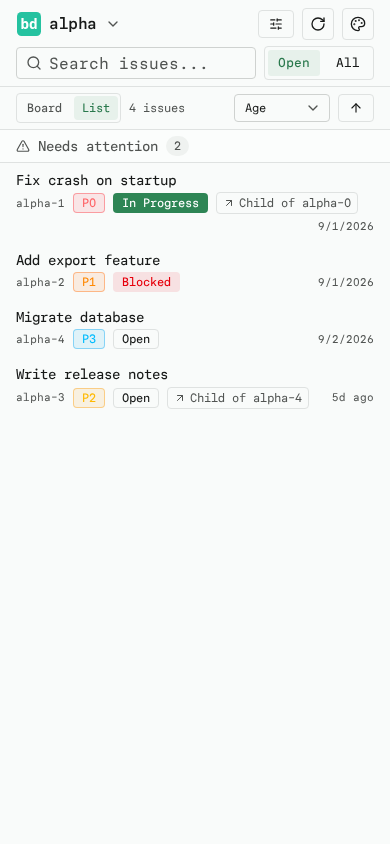
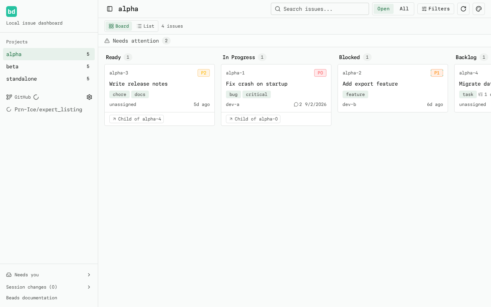
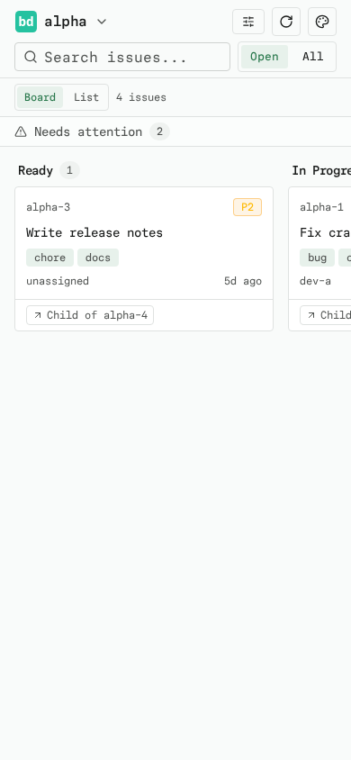

# List View

A compact table view that shows the same board issues as rows instead of
columns. Use the small **Board / List** toggle above the board to switch. The
toggle and any chosen sort are session state — they reset on reload and do not
touch the URL, so deep links and the polling refresh contract stay unchanged.

The **Needs attention** panel stays available in both views, and both views use
the exact same issue data (so project, search, and Open/All scope narrow the
list too). Clicking a row's title opens the same issue drawer.

## Desktop

Each row shows: **ID, Title, Priority, Status, Type, Parent, Assignee, Age**
(from `created_at`). Reused badges render priority, status, and type; age uses
the same relative-time formatting as the board cards.

The **Parent** column shows a clickable "Child of {parent-id}" chip for issues
with a parent and a dash for top-level issues. Clicking the chip opens the
parent in the issue drawer. It sorts by parent id with parentless issues last
in both directions.

## Mobile

Below `md` (768px) the list renders compact **title-first rows**: a 14px medium
title on top with a muted metadata line underneath showing the ID (mono),
priority, status, age, and a non-interactive "Child of {parent-id}" chip when
the issue has a parent. Long titles clamp to two lines and long IDs wrap, so
rows never force horizontal scrolling. The ID, status, and priority stay visible
at 360/390px widths.

## Sorting

Sorting is deterministic: sort by the chosen column, then by issue ID to break
ties.

- **Desktop** — each column header is a native button; clicking cycles
  ascending → descending → ascending. The active header shows an arrow and the
  `th` carries `aria-sort`.
- **Mobile** — the sort select and a direction button live in the same compact
  board toolbar row as the Board/List toggle and the issue count. An accessible
  labeled select picks the column and a direction button toggles
  ascending/descending.

The default is Age ascending (creation date, oldest first). Issues with a missing
value, invalid date, or blank assignee sort **last** in both directions rather
than being dropped or silently assumed. Long lists scroll within the viewport
with column headers pinned; the toolbar and mobile sort controls remain visible.

## Files

- `src/lib/list-sort.ts` — pure sorting logic + unit tests (`list-sort.test.ts`)
- `src/lib/hierarchy.ts` — per-parent child counts + unit tests
- `src/components/issue-list.tsx` — table (desktop) / row (mobile) view component
- `src/components/parent-link.tsx` — the clickable "Child of" chip
- `src/components/issue-card.tsx` — board card with parent chip and child count
- `src/components/board.tsx` — owns the Board/List toggle and sort state
- `tests/e2e/list-view.spec.ts`, `tests/e2e/parent-child.spec.ts` — Playwright coverage

## Screenshots

