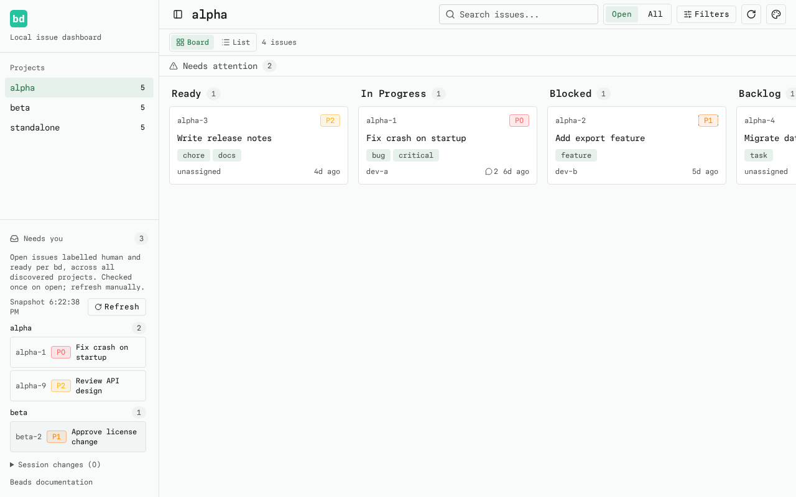
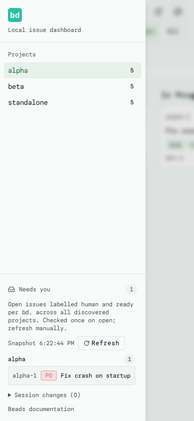

# Needs You

A read-only, cross-project inbox in the sidebar for issues that explicitly ask
for human input. It is deliberately separate from **Needs attention**, which
only suggests possibly urgent or stalled work based on heuristics.

## Label convention

An issue lands in the inbox when it carries the `human` label and is ready to
work on. This is an explicit opt-in convention:

```sh
bd update <issue-id> --add-label human
```

## Eligibility

`bd` is the authority. The dashboard asks each discovered project for

```
bd list --label human --ready --status open --limit 0
```

so an issue must be **open**, carry the **`human`** label, and pass `bd`'s own
`--ready` check (no active blockers). Closed, deferred, in-progress, and
dependency-blocked requests never appear. The panel never infers blockers from
issue counts or runs any per-issue commands; a small defensive normalizer only
drops malformed entries and requests whose `defer_until` is still in the future.
This first version has no gate-approval or reply workflow and never mutates
issues. Those actions remain separate future scope.

## Loading and refresh

The inbox is on-demand: nothing is fetched until you first open it, and it is
**not** part of the board polling loop. The summary shows no count before the
first load, so an unloaded panel can never be mistaken for zero. After the
first open the panel keeps its snapshot; **Refresh** clears the data cache and
loads a fresh snapshot. The snapshot timestamp is shown next to the button.
The 5-second server cache and a bounded fetch across projects (three at a
time per request, capped by project discovery) keep the cost low. Collapsing the
inbox retains its snapshot; reloading or recreating the mobile sidebar starts
unloaded again. Long results scroll inside a bounded sidebar panel.

## States

- **Empty** — *No issues need you right now.*
- **Total failure** — the error is shown and Refresh retries.
- **Partial results** — projects that could not be checked are listed with
  their error under the projects that did load. The count uses `N+` (or `?` when
  no project could be checked), rather than presenting an incomplete zero.
- **Failed refresh** — the previous snapshot remains available with an explicit
  stale-data warning and `!` indicator; it is not silently presented as fresh.

Issues are grouped by project with a count per group, ordered by priority then
id. Selecting an issue opens its normal drawer in that project, preserving the
current search and filters and the URL hash.

## Screenshots





## Files

- `src/lib/needs-you.ts` — shared contract, CLI args, normalization/sort + unit tests
- `src/app/api/needs-you/route.ts` — bounded, cached GET endpoint + unit tests
- `src/components/needs-you.tsx` — sidebar disclosure panel
- `src/components/dashboard.tsx` — sidebar integration (opens issues across projects)
- `tests/e2e/needs-you.spec.ts` — Playwright coverage
