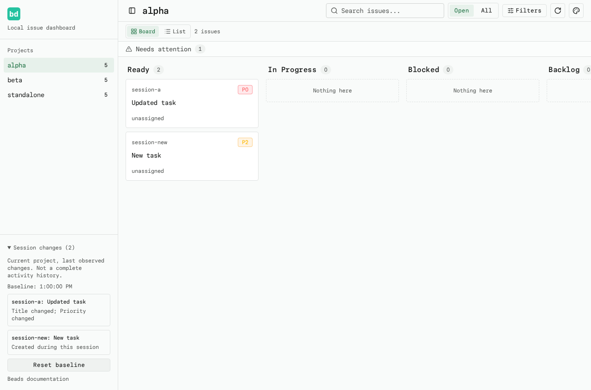
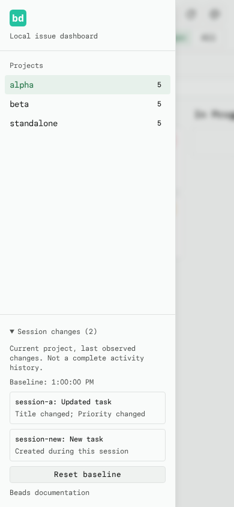

# Session Changes

Expand **Session changes** at the bottom of the project sidebar to review net
changes observed for the selected project. Select a row to open its issue;
**Reset baseline** acknowledges the current observations for that project.
Each project's baseline lasts until reload, independently of other projects.

Successful board responses are compared before search or facet filtering.
No extra requests, background monitoring, storage, or notifications are added.
Initial loading is silent. Failed and superseded requests do not change the
baseline. Hidden tabs keep the dashboard's existing polling pause and compare
the next successful response when visible again.

The summary checks title, priority, status, assignee, type and labels. Labels
are compared as sets. Timestamps and counters alone do not produce changes.
Changes that revert to the baseline disappear; each issue occupies one row.

A new issue is reported as Created only when its valid creation timestamp falls
within this session. First seeing an older or undated issue, such as a closed
issue revealed by All scope, silently adds it to the baseline. Closed/Reopened
are reported only from observed status differences. An issue disappearing from
Open scope does not prove it was closed or deleted. Last observations remain
in the summary, including for issues absent from subsequent responses.

This is not an audit log: intermediate transitions, unseen issues, description
edits and work done while the dashboard is stopped cannot be reconstructed.
Clock inaccuracies or missing creation dates can prevent creation detection.

