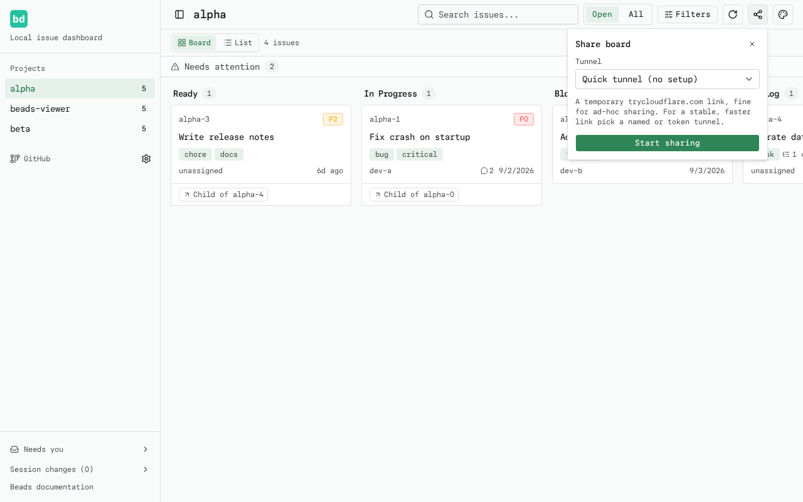
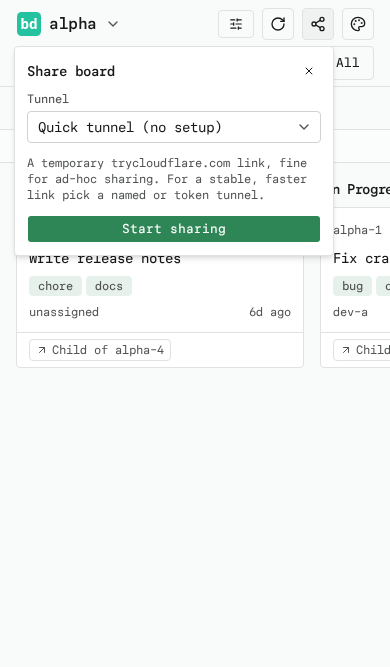

# Sharing

view-beads can hand a live view of the dashboard to anyone with a link. The
Share button in the header (next to the theme switcher) opens a panel that
starts a [Cloudflare tunnel](https://developers.cloudflare.com/cloudflared/)
and shows a public URL. Send it to a co-worker or manager and they see the
same boards you do, polling live — no server besides your own machine.

The tunnel is an encrypted relay from Cloudflare's edge to the dashboard on
your machine. Your machine stays the server, so the dashboard must keep
running for the link to work. While sharing is on, the board, the issue
drawers, and the settings panel are all reachable by anyone with the link;
the URL is unguessable but not secret. Stop sharing when you are done — the
link dies when the tunnel stops or the server shuts down.

## Requirements

- `cloudflared` on your `PATH`, or point `CLOUDFLARED_BIN` at the binary.
  `nix develop` includes it; elsewhere install it from
  [developers.cloudflare.com](https://developers.cloudflare.com/cloudflared/).

## Tunnel modes

The panel offers three tunnel modes; the selection persists to
`~/.config/view-beads/config.json` (`VIEW_BEADS_CONFIG`) and applies the
next time sharing starts. Each mode explains itself in the panel, and the
named and token modes include their setup steps under **Setup steps**.

### Quick tunnel

The default: a free, account-less `https://*.trycloudflare.com` link.
Fine for ad-hoc sharing, but Cloudflare caps quick tunnels around 200
requests in flight — a shared page can feel slow and leave the sidebar on
its loading state.

### Named tunnel (locally-managed)

One-time setup on the command line:

```sh
cloudflared tunnel login
cloudflared tunnel create view-beads
cloudflared tunnel route dns view-beads board.example.com
```

Then pick **Named tunnel** in the panel, enter the tunnel name and the
public URL (`https://board.example.com`), and start sharing.

### Token tunnel (remotely-managed)

1. In Cloudflare Zero Trust (**Networks > Tunnels**), create a tunnel, copy
   its token, and add a public hostname routed to `http://localhost:8439`
   (the default view-beads port).
2. Pick **Token tunnel** in the panel, paste the token and the public URL,
   and start sharing.

The token is saved to the local config file and never sent back to the
browser — the panel only shows whether one is saved.

### Environment variables

The same settings can come from the environment instead, for headless or
CI setups; env vars win over the config file, and the panel shows a notice
when they manage the tunnel:

```sh
CLOUDFLARED_TUNNEL_TOKEN=<token> \        # or CLOUDFLARED_TUNNEL_NAME=view-beads
CLOUDFLARED_SHARE_URL=https://board.example.com \
view-beads
```

## States

- The Share button spins while the tunnel starts.
- While sharing, the panel shows the public link, a copy button, and **Stop
  sharing**. The button stays pressed as long as a tunnel is running, even
  across reloads.
- If `cloudflared` is missing or fails, the panel shows the error and a
  **Try again** button.

## Screenshots




## Files

- `src/lib/tunnel.ts` — spawns `cloudflared`, parses the tunnel URL, stops it
- `src/lib/config.ts` — persists the tunnel settings with the repo selection
- `src/app/api/share/route.ts` — `GET` (status), `POST` (save + start), `PUT` (save), `DELETE` (stop)
- `src/components/share-button.tsx` — header button and share panel
