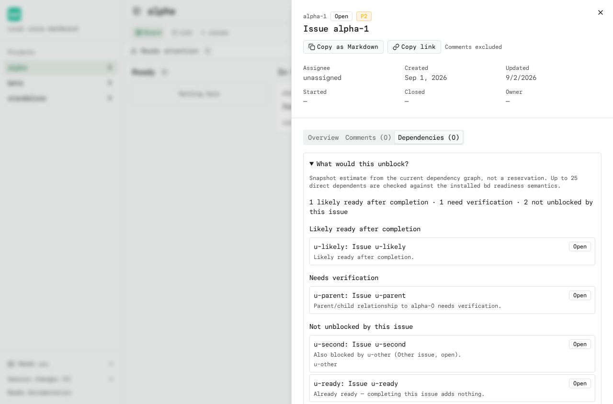
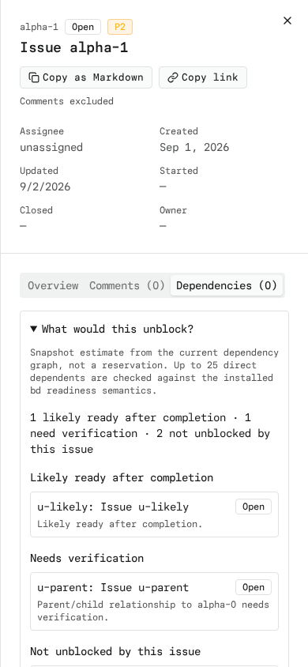

# Unblock Estimates

Open an issue's Dependencies tab and expand **What would this unblock?** to
see which dependents would plausibly become ready if that issue were
completed. It is a read-only snapshot of the current dependency graph, not a
reservation and not a prediction of what bd will decide at close time.

Results are grouped as:

- **Likely ready after completion** — the dependent is open, ordinary work,
  and `bd ready --explain` reports this issue as its sole active blocker.
- **Needs verification** — the dependent could not be positively confirmed:
  parent-child or parent-inherited blockers, conditional/waits-for/until
  edges, unknown relationship types, dependency cycles, missing records or
  counts, or a bd explain response whose shape cannot be trusted.
- **Not unblocked by this issue** — already ready, already closed/in
  progress/deferred, or still blocked by other issues (those remaining
  blockers are listed and linked).

Selecting any result opens that issue in the drawer and the Back trail returns
to the original issue.

## How it estimates

The endpoint (`/api/projects/[id]/issues/[issueId]/unblocks`) reads three
snapshots, all cached for 5 seconds and never written:

1. `bd show <root> --include-dependents` for the hydrated dependents and edge
   types (the same cached call the drawer's graph uses),
2. `bd ready --explain --limit 0 --json` for the project's blocked list and
   cycle count,
3. one batch `bd show <ids...>` for the full records of up to 25 candidates.

A candidate is only marked likely when every check agrees: the root is still
active (including hooked), the candidate is open work of an ordinary type
(not pinned, template, ephemeral, or no-history), its deferral is in the past
or absent, its dependency list is complete, every other `blocks` edge points at
a closed/pinned target, the only other edges are known non-blocking
associations, and the root's own blocking edge is visible from the candidate
record. The explain snapshot's root status must match the root record; a
candidate listed as both ready and blocked is never estimated. Anything less —
including a project with dependency cycles or an unknown cycle count, waits-for
and conditional-blocks edges, or a bd explain response whose shape cannot be
trusted — is reported for verification, never guessed. The estimate is
deliberately conservative: false negatives are explained, false guarantees are
not.

This is a snapshot, not a simulation: completing the root is never staged or
closing it never simulated. `bd ready` remains the authority on actual
readiness.

